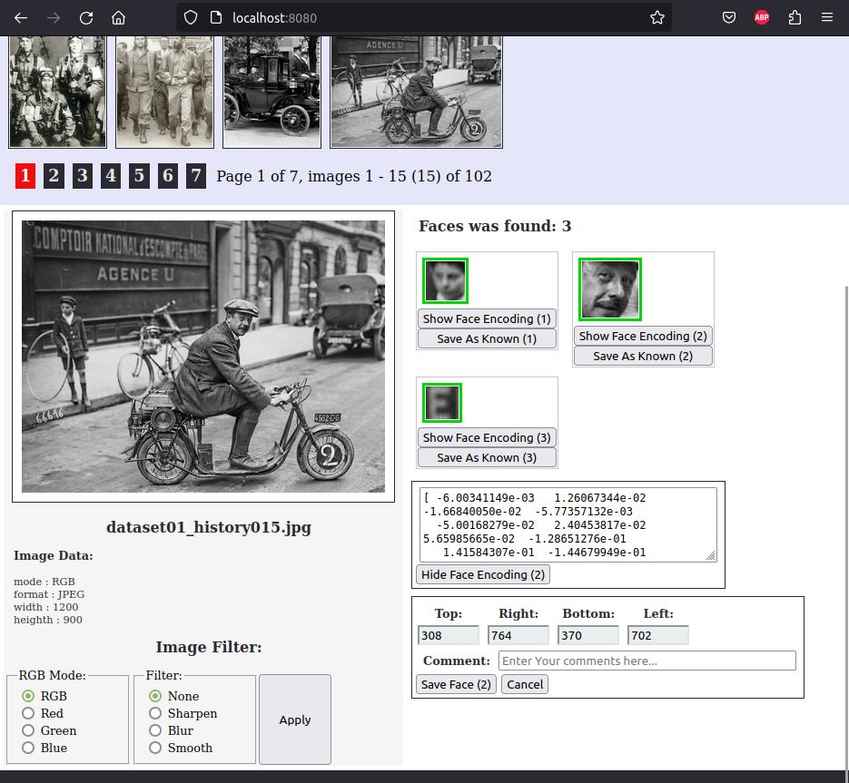
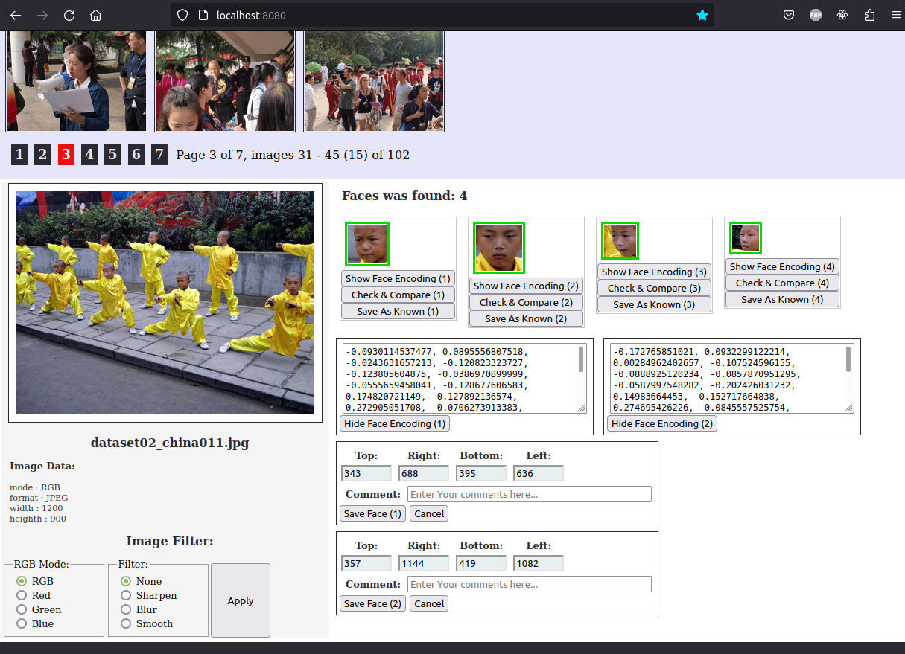
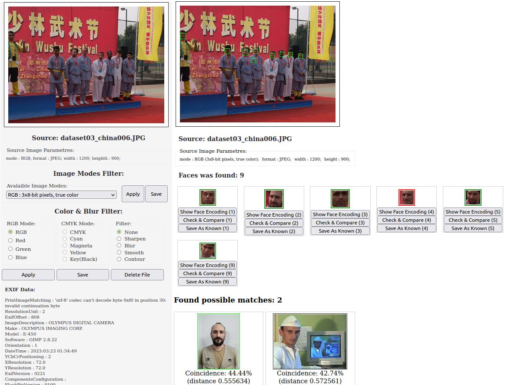

# CVision
Faces recognition from photos &amp; web-camera (Experimental &amp; training project)

# Dependencies

## 1. Install & upgrade PIP:

a) install:

	sudo apt install python-pip (for python 2.x)
or
	sudo apt install python3-pip (for python 3.x)

b) upgrade:

	pip install --upgrade pip (for python 2.x)
or 

	pip3 install --upgrade pip (for python 3.x)
	
Don't use 'sudo pip' (see https://github.com/pypa/pip/issues/5599)

## 2. Install Flask:

	sudo apt install python-requests python3-flask 
	sudo apt install python3-requests python3-flask 
	
or (better):

	pip install flask
	pip3 install flask

## 3. Install OpenCV & Face recognition:

a). Scipy & Numpy:

	sudo apt install python-scipy python-numpy
	sudo apt install python3-scipy python3-numpy
	
b) OpenCV:
	
	sudo apt install python3-opencv
	sudo apt install python3-opencv
	
or

	pip install opencv-python
	pip3 install opencv-python
	
c) Face recognition (https://pypi.org/project/face-recognition/)
	
Probably, on this stages You can get error "ImportError: No module named skbuild" -  just install it!

	pip install scikit-build
	pip3 install scikit-build
	
Than install dlib & face_recognition:

	pip install dlib
	pip3 install dlib
	pip install face_recognition
	pip3 install face_recognition
	
d) Check that Pillow library is installed or install it:

	sudo apt install python-pillow
	sudo apt install python3-pillow
	
or 
	
	pip install pillow
	pip3 install pillow
	
## 4. Add your own photos to app/imgbase/

## 5. Run application:

	cd app
	python[3] webapp.py
	
## Run Your favorive web-browser & go to http://localhost:8080

