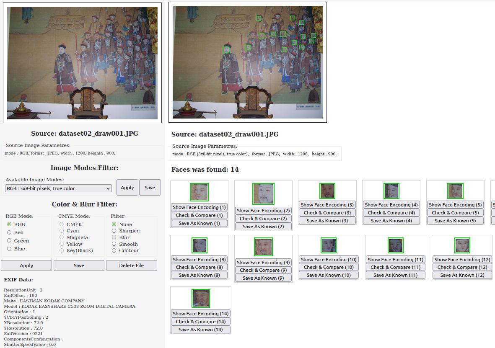

# CVision
Faces recognition from photos &amp; web-camera (Experimental &amp; training project)

# 1. Install in virtual environment:

Note. When I specified a python version for the virtual environment that matches the default system version (my default version was 3.6.9), the package installation was successful.
But with a newer version of python (version 3.8 already was installed in system), the installation gave an error when trying to install dlib package. I haven't found a solution for this problem yet.

## 1.1 Install venv:

	sudo apt install python[3]-venv

*Package name depends on default python version in your system. Check it with commands 'python -V' , 'python3 -V'. Python-venv is avalaible only for version 3.x

## 1.2 Create virtual environment:
 
	cd {projrct_folder}
	python3[.x] -m venv {environment_name}

[.x] is selectet python version

## 1.3 Activate virtual environment and check the versions:

	source {environment_name}/bin/activate
	python -V
	pip -V

## 1.4 Upgrade pip:

	pip install --upgrade pip

## 1.5 Install dependencies:

	pip install -r requirements.txt

## 1.6 Start application:

	cd app
	python main.py

# 2. Install with default system python:

## 2.1 Install & upgrade PIP:

Check default verson with 'python -V' , 'python3 -V'. 

a) install:

	sudo apt install python-pip (for python 2.x)
or
	sudo apt install python3-pip (for python 3.x)

b) upgrade:

	pip install --upgrade pip (for python 2.x and probably for python 3.x if python2 is not installed)

or 

	pip3 install --upgrade pip (for python 3.x)

Don't use 'sudo pip' (see https://github.com/pypa/pip/issues/5599)

Note: If you had python 2.x and pip was installed for python 2.x too, chech the default pip version ufter update. 
Most likely that after the upgrade the default version of pip will be work with python 3.x. Check it with commands 'pip -V', 'pip2 -V', 'pip3 -V'. 

The results could be like this:
	pip -V
	pip 21.3.1 from /home/username/.local/lib/python3.6/site-packages/pip (python 3.6)

	pip2 -V
	pip 20.3.4 from /home/username/.local/lib/python2.7/site-packages/pip (python 2.7)

	pip3 -V
	pip 21.3.1 from /home/username/.local/lib/python3.6/site-packages/pip (python 3.6)

## 2.2 Install dependencies:

You can install dependencies via pip using a requirements file:

	pip[3] install -r requirements.txt

... or do it separately for each package:

## 2.2.1 Install Flask:

	sudo apt install python[3]-requests python[3]-flask 

or (better):

	pip[3] install flask

## 2.2.2 Install OpenCV & Face recognition:

a). Scipy & Numpy:

	sudo apt install python[3]-scipy python[3]-numpy
or

	pip[3] install scipy
        pip[3] install numpy

b) OpenCV:

	sudo apt install python[3]-opencv

or

	pip[3] install opencv-python

c) Face recognition (https://pypi.org/project/face-recognition/)

Probably, on this stages you can get error "ImportError: No module named skbuild" -  just install it!

	pip[3] install scikit-build

Than install dlib & face_recognition:

	pip[3] install dlib
	pip[3] install face_recognition

d) Check that Pillow library is installed or install it:

	sudo apt install python[3]-pillow

or 

	pip[3] install pillow

## 2.3 Add your own photos to app/imgbase/

## 2.4 Run application:

	cd app
	python[3] webapp.py

## Run Your favorive web-browser & go to http://localhost:8080

