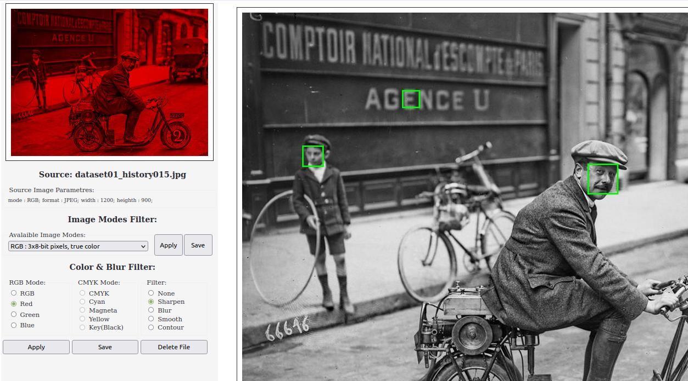

# CVision.

Experimental training web application using dlib/face_recognition & Flask.
Allows you to load images, find faces in images and save them for later comparison and search, 
compare faces in photos with previously saved ones and search for similar faces in photos, 
calculate the percentage of matches and the distance between faces found and previously saved.
It also allows you to change loaded images (8-bit grayscale - RGB - CMYK), 
use filters by color channels (R,G,B or C,M,Y,K), use blur, sharpen, smooth or counter filtres. 

## Requirements:

+python 3 (3.6 or higher);
+python-opencv
+dlib & face_recognition
+flask

## 1. Start application in virtual environment:

> Note. When I specified a python version for the virtual environment that matches the default system version (my default version was 3.6.9), the package installation was successful.
But with a newer version of python (version 3.8 already was installed in system), the installation gave an error when trying to install dlib package. 
I haven't found a solution for this problem yet.

### 1.1 Install venv:

```shell
	sudo apt install python[3]-venv
```

*Package name depends on default python version in your system. Check it with commands 'python -V' , 'python3 -V'. 
Python-venv is avalaible only for version 3.x. Application require python 3.x too (3.6 or higher).*

### 1.2 Create virtual environment:

```shell
	cd {projrct_folder}
	python3[.x] -m venv {environment_name}
```

[.x] is selectet python version

### 1.3 Activate virtual environment and check the versions:

```shell
	source {environment_name}/bin/activate
	python -V
	pip -V
```

### 1.4 Don't forget to upgrade pip:

```shell
	pip install --upgrade pip
```

### 1.5 Install dependencies:

```shell
	pip install -r requirements.txt
```

## 1.6 Start application:

```shell
	cd app
	python main.py
```

(or run ``` source start.sh ```)

### 1.7 Run http://localhost:8080 in browser

## 2. Install with default system python:

### 2.1 Install & upgrade PIP:

Check default verson with 'python -V' , 'python3 -V'. 

a) install:

```shell
	sudo apt install python[3]-pip (for python 3.x)
```

b) upgrade:

```shell
	pip[3] install --upgrade pip (for python 3.x)
```

None: Don't use 'sudo pip' (see https://github.com/pypa/pip/issues/5599)

Note: If you had python 2.x and pip was installed for python 2.x too, chech the default pip version ufter update. 
Most likely that after the upgrade the default version of pip will be work with python 3.x. Check it with commands 'pip -V', 'pip2 -V', 'pip3 -V'. 

The results could be like this:

```shell
	pip -V
	pip 21.3.1 from /home/username/.local/lib/python3.6/site-packages/pip (python 3.6)

	pip2 -V
	pip 20.3.4 from /home/username/.local/lib/python2.7/site-packages/pip (python 2.7)

	pip3 -V
	pip 21.3.1 from /home/username/.local/lib/python3.6/site-packages/pip (python 3.6)
```

### 2.2 Install dependencies:

Install dependencies via pip using a requirements file:

```shell
	pip[3] install -r requirements.txt
```

### 2.3 Run application:

```shell
	cd app
	python[3] webapp.py
```
(or run ``` source start.sh ```)

### 2.4 Run http://localhost:8080 in browser

Some screenshots:

- Opening image file, faces recognition, getting faces encodings:


- Color channel's filter, sharpen/blur filter, imagezoom:



- Faces recognition & finding matches in database with best match highlight:


